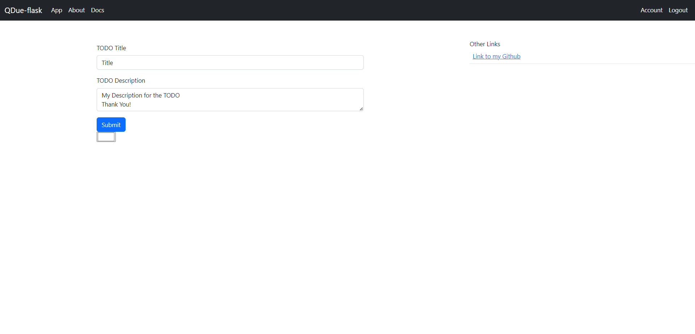
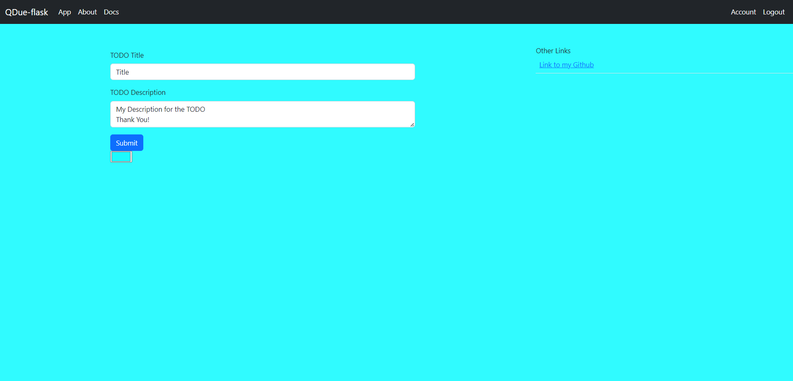

# QDue-flask
   

- [QDue-flask](#qdue-flask)
  - [Screenshot](#screenshot)
  - [Supported Architectures](#supported-architectures)
  - [Installation](#installation)
    - [Direct Run - Development Server](#direct-run---development-server)
    - [Run - Production Server](#run---production-server)
    - [Build Docker image](#build-docker-image)
    - [Run from pre-build docker image](#run-from-pre-build-docker-image)
    - [Deploy with docker compose file](#deploy-with-docker-compose-file)
    - [Run with Postgresql databse](#run-with-postgresql-databse)
      - [Example:](#example)
  - [Configuration](#configuration)
    - [Set a admin user in Postgresql](#set-a-admin-user-in-postgresql)
  - [Docker Parameters](#docker-parameters)
  - [TODO list](#todo-list)


QDue-Flask is a todo application built using the Flask web framework in Python. The application features a RESTful API system that allows users to interact with the app programmatically. The API system includes endpoints for creating, updating, and deleting todo items, as well as for retrieving all the todo items for a specific user.

The application also has a login system that allows users to securely create an account, log in, and log out. User passwords are hashed using the bcrypt package before being stored in the database to ensure their security.

QDue-Flask allows users to create, edit, and delete todo items, which are organized by priority and due date. The app uses a SQLite database to store user information and todo items. Users can view their todo items on the app's dashboard, which displays the items in a list format with due dates and priorities.

Overall, QDue-Flask is a simple and effective todo app that provides users with a convenient way to manage their daily tasks.

## Screenshot

| Sr. No. |  Image |
|---|---|
| 1.  |   |
| 2.  |   |
| 3.  |   |
| 4.  |   |

## Supported Architectures
| Architecture |	Available |
|---|---|
|linux/amd64 |	<p style="text-align: center;">✅</p>|
|linux/arm64|	<p style="text-align: center;">✅</p>|

## Installation
1. `git clone https://github.com/vedantjain8/QDue-Flask.git`
2. `cd QDue-Flask`
3. `pip install -r requirements.txt`

### Direct Run - Development Server
4. `python3 -m main.py`
> Set `app.debug=True` in [main.py](https://github.com/vedantjain8/qdue-flask/blob/main/main.py) file

### Run - Production Server
4. `gunicorn main:app -b 0.0.0.0:80 --workers 2`

### Build Docker image
4. `docker build -t qdueflask .`
5. `docker run -d --name=qdueflask -e SECRET_KEY="my_secret_key" -e GUNICORN_WORKERS=2 -p 7001:80 --restart=unless-stopped qdueflask`
> [Click here to see the available docker parameters](#docker-parameters)

### Run from pre-build docker image
1. `docker run -d --name=qdueflask -e SECRET_KEY="my_secret_key" -e GUNICORN_WORKERS=2 -p 7001:80 --restart=unless-stopped ghcr.io/vedantjain8/qdue-flask:latest`
> [Click here to see the available docker parameters](#docker-parameters)

### Deploy with docker compose file
1. Download this file > [dockercompose.yml](https://github.com/vedantjain8/qdue-flask/blob/main/dockercompose.yml)
2. Run `docker compose up`

### Run with Postgresql databse
1. `docker run --name=qdueflask-db --network=host -v qdueflask-db-data:/var/lib/postgresql/data -e POSTGRES_PASSWORD=<db password> -e POSTGRES_USER=<db username> -e POSTGRES_DB=<db database> -d postgres`
2. `docker run -d --name=qdueflask -e db_username=<db username> -e db_password=<db password> -e db_host=<db localhost> -e db_port=<db port> -e db_database=<db database> -e SECRET_KEY="my_secret_key" -e GUNICORN_WORKERS=2 -p 7001:80 --restart=unless-stopped ghcr.io/vedantjain8/qdue-flask:latest`

#### Example: 
```
sudo docker run --name=qdueflask-db --network=host -v qdueflask-db-data:/var/lib/postgresql/data -e POSTGRES_PASSWORD=flasktodoAdmin -e POSTGRES_USER=flasktodoAdmin -e POSTGRES_DB=flasktodoAdmin -d postgres

sudo docker run -d --name=qdueflask-app -e db_username=flasktodoAdmin -e db_password=flasktodoAdmin -e db_host=192.168.29.8 -e db_database=flasktodoAdmin -e SECRET_KEY="my_secret_key" -e GUNICORN_WORKERS=2 -p 7001:80 --restart=unless-stopped ghcr.io/vedantjain8/qdue-flask:latest
```

## Configuration

### Set a admin user in Postgresql
`sudo docker exec -it qdueflask-db psql -U <db_username>`
`update "user" set admin=true where username="admin";`

## Docker Parameters
| Argument  | Description  | Default Value |
|---|---|---|
| `-e SECRET_KEY="my_secret_key"`  | Change "my_secret_key" to random string | `default_secret_key` |
| `-e db_username` | (Optional) Database username |  |
| `-e db_password` | (Optional) Database password | |
| `-e db_host` | (Optional) Database ip address or hostname | <center>`127.0.0.1`</center> |
| `-e db_port` | (Optional) Database port | |
| `-e db_database` | (Optional) Database name | |
| `-e TZ="Europe/London" ` | (Optional) Time zone name like  | <center>UTC time zone</center> |
| `-e logSize=3221225472 ` | (Optional) In bytes, changes the log file when this limit is reached  | <center>`3221225472`</center> ~3GB |
| `-e logBackup=5 ` | (Optional) Log file backup count, will delete old backup file to create space for new file  | <center>5</center> |
| `-e GUNICORN_WORKERS=2` | The number of worker processes. This number should generally be between 2-4 workers per core in the server | <center>`4`</center> |
| `-p 7001:80` | WebUI |  |

## TODO list
- [x] sqlite to MongoDB or PostgreSQL 
- [x] Point the root to app path
- [x] password change
- [x] add url route logging
- [ ] notes layout with flexbox
- [ ] export & import TODOs
- [ ] reposition the select color button
- [ ] Add validation for everything
- [ ] Add privacy so that no one can see my notes