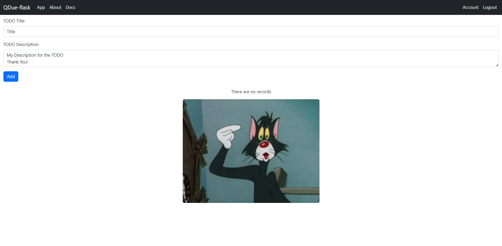

# QDue-flask
   

- [QDue-flask](#qdue-flask)
  - [Screenshot](#screenshot)
  - [Installation](#installation)
    - [Direct Run - Development Server](#direct-run---development-server)
    - [Run - Production Server](#run---production-server)
    - [Build Docker image](#build-docker-image)
  - [TODO](#todo)

QDue-Flask is a todo application built using the Flask web framework in Python. The application features a RESTful API system that allows users to interact with the app programmatically. The API system includes endpoints for creating, updating, and deleting todo items, as well as for retrieving all the todo items for a specific user.

The application also has a login system that allows users to securely create an account, log in, and log out. User passwords are hashed using the bcrypt package before being stored in the database to ensure their security.

QDue-Flask allows users to create, edit, and delete todo items, which are organized by priority and due date. The app uses a SQLite database to store user information and todo items. Users can view their todo items on the app's dashboard, which displays the items in a list format with due dates and priorities.

Overall, QDue-Flask is a simple and effective todo app that provides users with a convenient way to manage their daily tasks.

## Screenshot

| Sr. No. |  Image |
|---|---|
| 1.  |   |
| 2.  |   |
| 3.  |   |
| 4.  |   |

## Installation
1. `git clone https://github.com/vedantjain8/QDue-Flask.git`
2. `cd QDue-Flask`
3. `pip install -r requirements.txt`

### Direct Run - Development Server
4. `python3 -m main.py`

### Run - Production Server
4. `gunicorn main:app -b 0.0.0.0:80 --workers 2`

### Build Docker image
4. `docker build -t qdueflask .`
5. `docker run -d --name=qdueflasktest -e SECRET_KEY=my_secret_key -e GUNICORN_WORKERS=2 -p 7001:80 --restart=unless-stopped qdueflask`

## TODO
[ ] sqlite to MongoDB or PostgreSQL